* Table of Contents
{:toc}

--------------------------------------------------------------------------------------------------------------------

## **Setting up, getting started**

Refer to the guide [_Setting up and getting started_](SettingUp.md).

--------------------------------------------------------------------------------------------------------------------

## **Design**

### Architecture

The ***Architecture Diagram*** given above explains the high-level design of the App. Given below is a quick overview of each component.

:bulb: **Tip:** The `.puml` files used to create diagrams in this document can be found in the [diagrams](https://github.com/se-edu/addressbook-level3/tree/master/docs/diagrams/) folder. Refer to the [_PlantUML Tutorial_ at se-edu/guides](https://se-education.org/guides/tutorials/plantUml.html) to learn how to create and edit diagrams.

**`Main`** has two classes called [`Main`](https://github.com/AY2021S1-CS2103-F09-2/tp/blob/master/src/main/java/seedu/pivot/Main.java) and [`MainApp`](https://github.com/AY2021S1-CS2103-F09-2/tp/blob/master/src/main/java/seedu/pivot/MainApp.java). It is responsible for,
* At app launch: Initializes the components in the correct sequence, and connects them up with each other.
* At shut down: Shuts down the components and invokes cleanup methods where necessary.

[**`Commons`**](#common-classes) represents a collection of classes used by multiple other components.

The rest of the App consists of five components.

* [**`UI`**](#ui-component): The UI of the App.
* [**`Logic`**](#logic-component): The command executor.
* [**`Model`**](#model-component): Holds the data of the App in memory.
* [**`Storage`**](#storage-component): Reads data from, and writes data to, the hard disk.
* [**`State`**](#state-component): Holds the states of the App while the app is active.

The first four components,

* defines its *API* in an `interface` with the same name as the Component.
* exposes its functionality using a concrete `{Component Name}Manager` class (which implements the corresponding API `interface` mentioned in the previous point.

For state component, it is managed by two classes:
* `StateManager` class which provides general access to the state of the App.
* `UIStateManager` class which provides the GUI access to the state of the app.

Example of architecture: The `Logic` component (see the class diagram given below) defines its API in the `Logic.java` interface and exposes its functionality using the `LogicManager.java` class which implements the `Logic` interface.

**How the architecture components interact with each other**

The *Sequence Diagram* below shows how the components interact with each other for the scenario where the user issues the command `delete 1`.

The sections below give more details of each component.

### UI component

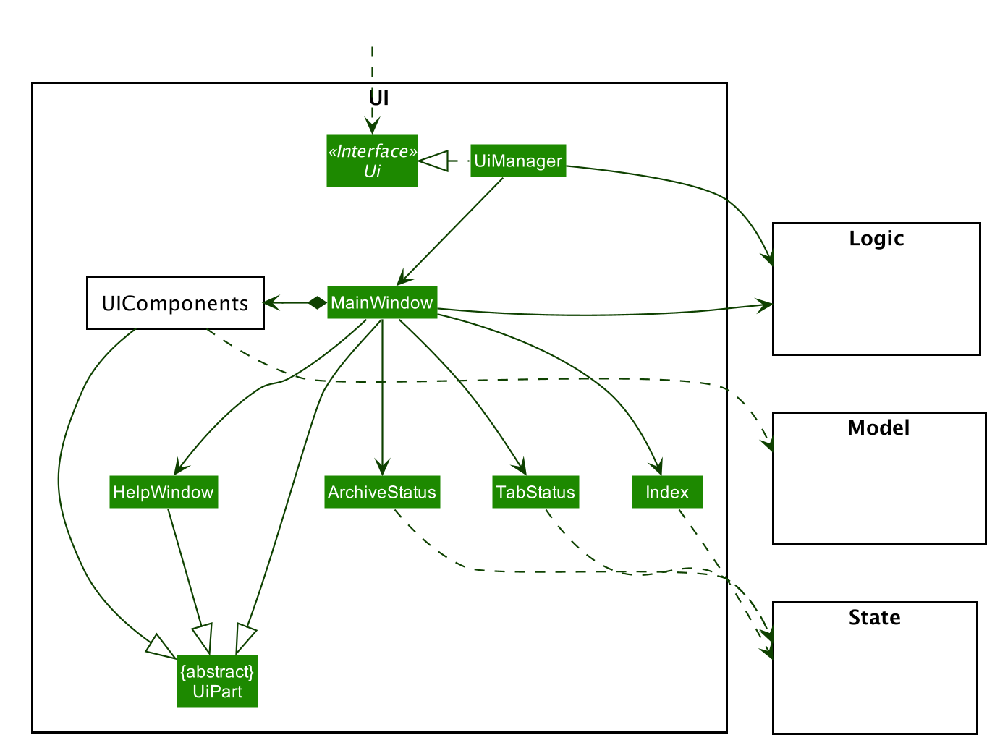

**API** :
[`Ui.java`](https://github.com/AY2021S1-CS2103-F09-2/tp/blob/master/src/main/java/seedu/pivot/ui/Ui.java)

The UI consists of a `MainWindow` that is made up of parts e.g.`CommandBox`, `ResultDisplay`, `PersonListPanel`, `StatusBarFooter` etc. All these, including the `MainWindow`, inherit from the abstract `UiPart` class.

The `UI` component uses JavaFx UI framework. The layout of these UI parts are defined in matching `.fxml` files that are in the `src/main/resources/view` folder. For example, the layout of the [`MainWindow`](https://github.com/AY2021S1-CS2103-F09-2/tp/blob/master/src/main/java/seedu/pivot/ui/MainWindow.java) is specified in [`MainWindow.fxml`](https://github.com/AY2021S1-CS2103-F09-2/tp/blob/master/src/main/resources/view/MainWindow.fxml)

The `UI` component,

* Executes user commands using the `Logic` component.
* Listens for changes to `Model` data so that the UI can be updated with the modified data.
* Listens for changes to `State` data so that the UI can be updated with the modified data.

The example for observing states is illustrated with the Sequence Diagram below.
The `MainWindow` observes the `UiStateManager` for any changes to its internal state.
Upon invoking `open case 1`, the state changes and the `MainWindow` if notified by its `Observer`.
It then retrieves the information it requires and displays on its display panel.

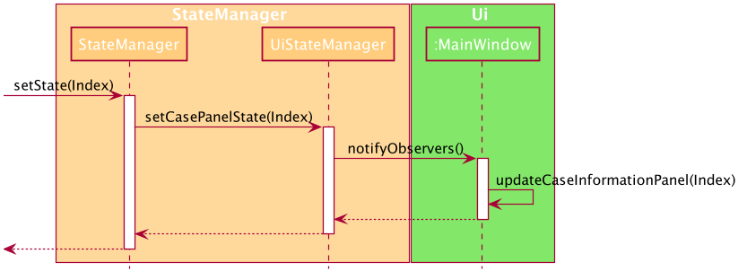

### Logic component

**API** :
[`Logic.java`](https://github.com/se-edu/addressbook-level3/tree/master/src/main/java/seedu/address/logic/Logic.java)

1. `Logic` uses the `PivotParser` class to parse the user command.
1. This results in a `Command` object which is executed by the `LogicManager`.
1. The command execution can affect the `Model` (e.g. deleting a case).
1. The result of the command execution is encapsulated as a `CommandResult` object which is passed back to the `Ui`.
1. In addition, the `CommandResult` object can also instruct the `Ui` to perform certain actions, such as displaying help to the user.

Given below is the Sequence Diagram for interactions within the `Logic` component for the `execute("delete case 1")` API call.

:information_source: **Note:** The lifeline for `DeleteCommandParser` should end at the destroy marker (X) but due to a limitation of PlantUML, the lifeline reaches the end of diagram.

The case below follows the same execution above. However, the AddCommandParser further calls the AddCaseCommandParser which returns the respective AddCaseCommand, which has been extended from the AddCommand Class.

:information_source: **Note:** The lifeline for `AddCommandParser` and `AddCaseCommandParser` should end at the destroy marker (X) but due to a limitation of PlantUML, the lifeline reaches the end of diagram.

### Model component

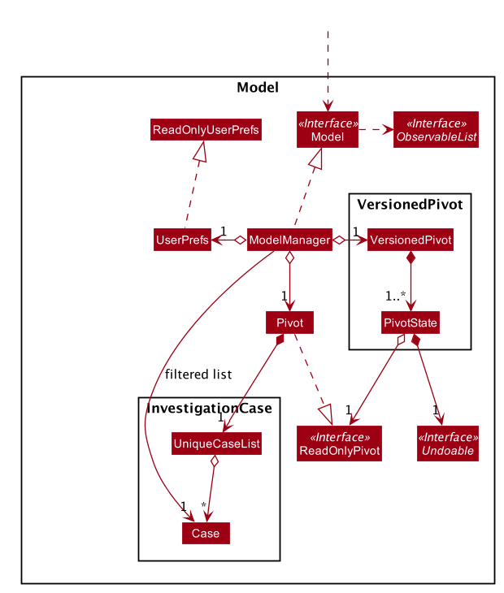

**API** : [`Model.java`](https://github.com/AY2021S1-CS2103-F09-2/tp/blob/master/src/main/java/seedu/pivot/model/Model.java)

The `Model`,

* stores a `UserPref` object that represents the user’s preferences.
* stores the PIVOT data.
* stores the history of PIVOT states.
* exposes an unmodifiable `ObservableList<Case>` that can be 'observed' e.g. the UI can be bound to this list so that the UI automatically updates when the data in the list change.
* does not depend on any of the other three components.

The detailed class diagram for the investigation case package is shown below. 
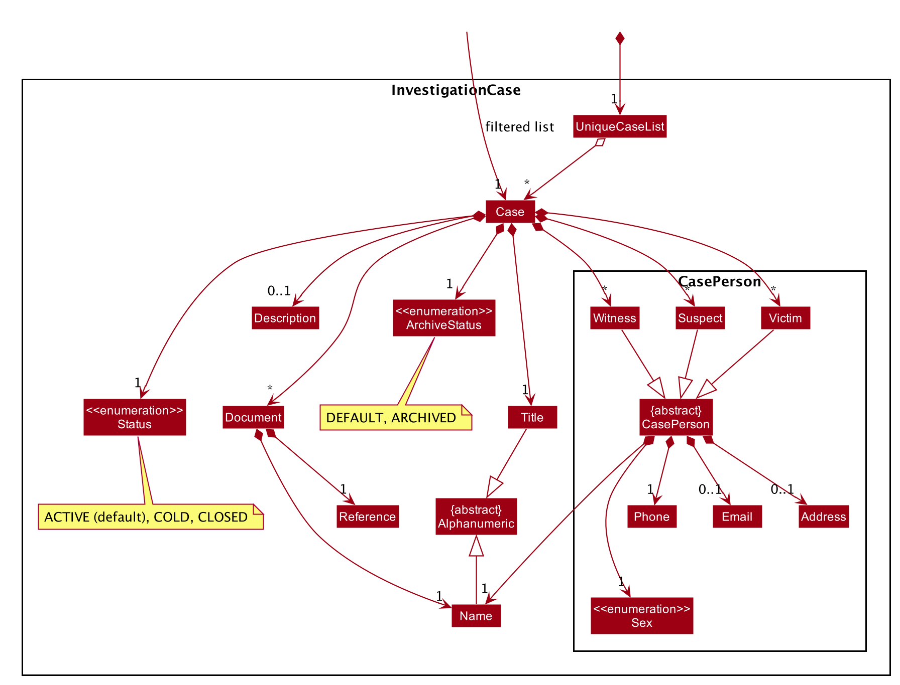

### Storage component

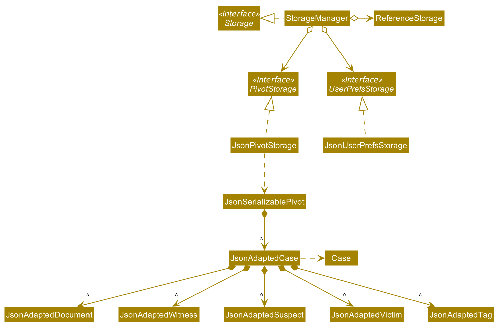

**API** : [`Storage.java`](https://github.com/AY2021S1-CS2103-F09-2/tp/blob/master/src/main/java/seedu/pivot/storage/Storage.java)

The `Storage` component,
* can save `UserPref` objects in json format and read it back.
* can save Pivot's data in json format and read it back.

### State component

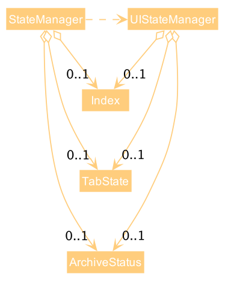

**API** : [`StateManager.java`](https://github.com/AY2021S1-CS2103-F09-2/tp/blob/master/src/main/java/seedu/pivot/logic/state/StateManager.java), [`UiStateManager.java`](https://github.com/AY2021S1-CS2103-F09-2/tp/blob/master/src/main/java/seedu/pivot/ui/UiStateManager.java)

The `StateManager` component,
* can set the state for an opened `Case` in the app, denoted by its `Index`.
* can set the state for an opened `Section` in the app, denoted by its `ArchiveStatus`.
* can set the state for an opened `Tab` in the app, denoted by its `TabState`.
* can reset the state.
* can return the state.
* can request the `UiStateManager` to refresh its state.

The `UiStateManager` component,
* can set the state for an opened `Case` in the app, denoted by its `Index`.
* can set the state for an opened `Section` in the app, denoted by its `ArchiveStatus`.
* can set the state for an opened `Tab` in the app, denoted by its `TabState`.
* can reset the state.
* can refresh its state.

When the `StateManager` modifies its State, it will also call upon `UiStateManager` to update its state as well.
This triggers any observation set on the respective `State` managers by the other components.
One such example can be found in the `UI` component.

### Common classes

Classes used by multiple components are in the `seedu.pivot.commons` package.

--------------------------------------------------------------------------------------------------------------------

## **Implementation**

This section describes some noteworthy details on how certain features are implemented.

### Open Case/Return feature
The `open case` command allows the user to open an investigation case listed on the `Main Page` in the GUI.
PIVOT then extracts and displays the key information about the `Case` in the `Case Page` Panel.

#### Implementation: Open Case
The `open case` mechanism is facilitated by `OpenCaseCommand`. It extends abstract class `OpenCommand` and contains a target `Index` of the `Case` to be opened.
It implements `OpenCaseCommand#execute()` as required in the abstract parent class. The Sequence Diagram below shows how the `OpenCaseCommand` works.

As the user invokes `open case [INDEX]`, the arguments are passed from the GUI to the `Logic` component, which is then passed to the `Parser`, implemented by `PivotParser`.

In `PivotParser`, the arguments are processed and passed onto the `OpenCommandParser` to further process the arguments and create a new `OpenCaseCommand`.

:information_source: **Note:** When the user gives an invalid `type`, such as `open suspect 1`, `OpenCommandParser` will raise and error and display the proper command format for the user.

Upon invoking `OpenCaseCommand#execute()`, the class will extract the `Case` that is to be opened, and update the state in `StateManager`.
Upon observing a change in state, the GUI will then extract the `Case` and update its display panel with the case information.

:information_source: **Note:** When the user gives an invalid `Index`, such as `open case -1`, `OpenCaseCommand` will raise and error and display the proper command format for the user.

#### Implementation: Return
The `return` mechanism is facilitated by `ReturnCommand`.
It allows the user to close the `Case Page` panel and return to the `Main Page`.
Its implementation is similar to the `OpenCaseCommand` except it resets the state in `StateManager` instead of setting a state.

### Including Documents to PIVOT

#### Reference class
The `Reference` class represents a file location in the directory `./references` of the program. A `reference` only
exists if there is a file present at the file location in the user's local directory. The validity of a
`reference` depends on the user's operating system and the different acceptable file names. A `reference` object must
have a valid file name on creation.

#### Document class
The `Document` class represents a file on the user's local computer. It contains a `name` for easy viewing
and a `reference` to the file location. It is used for tracking files that are stored in PIVOT and for opening
of documents.
 
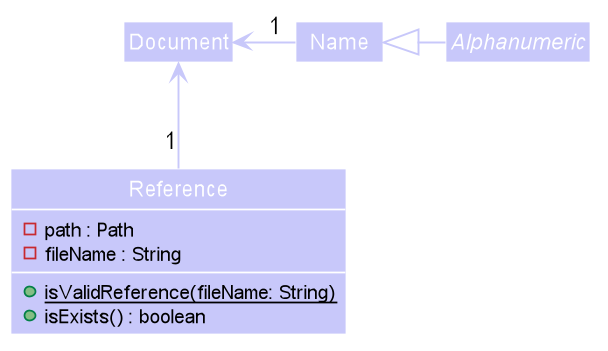

The documents are stored in a list for a particular case and you can only manipulate
documents(adding, deleting, opening) while inside a `case`. This is because the program stores a state of which
interface (main page or case) the user is at and will manipulate the documents according to the `document list` in that
current `case`.

#### Adding a Document
When a user executes `add doc n:name r:reference.txt`, to add a document with the specified name and file reference
to the current "opened" case in the state, `AddDocumandCommandParser` will be invoked to parse the
name (prefixed with n:) and reference (prefixed with r:) inputs. The program must be at an "opened" case at this point.
   
`AddDocumandCommandParser` will check for a valid name as well as a valid
reference that exists in the `./references` directory. This is to prevent a user from creating a document when the
program is active when they have yet to include the file in the program's directory. The appropriate error message
should be returned for a better user experience. It will then successfully create a `Document` and
return `AddDocumandCommand`
  
`AddDocumandCommand` will get the current `case` in the program `state` and adds the new `Document` to this `case`.
It will check for duplicated documents at this point as this is where the program accesses the list of documents in the
current state. The `model` will then be updated with the updated `case`.

The following sequence diagram shows adding a document to the current case:  
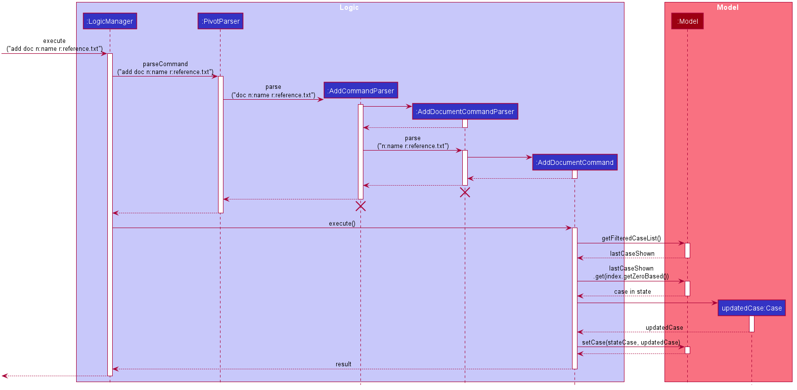

#### Deleting a Document
Deleting a document works about the same as adding a document. When a user executes `delete doc 2`, to delete the
second `document` in the list of documents of the current "opened" case in the state. The program must be at an
"opened" case at this point.`DeleteCommandParser` parses the given index as a `Index` object and gets the `case index`
in the current state. It returns `DeleteDocumentCommand` if the inputs are valid.
  
`DeleteDocumentCommand` gets the list of documents in the current case using the `case index` and checks if the
input `index` is within bounds. The check occurs in the `Command` rather than `DeleteDocumentParser` so that we
can distinguish between `ParseException` and `CommandException`. The command then removes the specified `document`
in the list and updates the `model`.

The following activity diagram shows a successful delete document operation at a case page:  
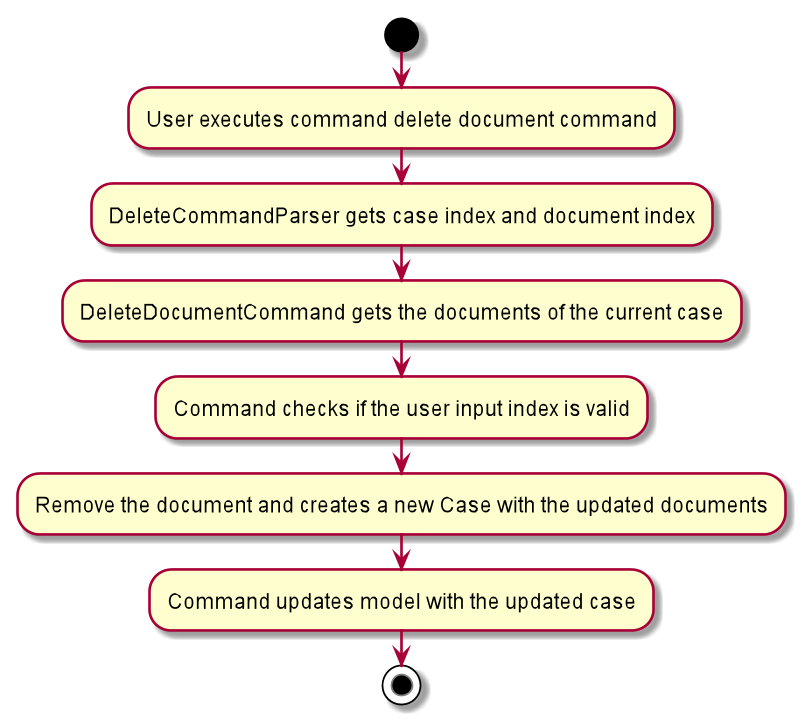

#### Design considerations
##### Aspect: For `Reference` object, separate validity (of the String) and existence (of the actual file path) checks.
* **Alternative 1 (current choice):** A reference object can be both valid but doesn't exists at the same time.
   - Pros: A document file deletion on the user's local machine will not affect loading the current cases in the Json
   file
   - Cons: User will only know that the file doesn't exist when he opens it

* **Alternative 2:** A reference object must be both valid and exists to be created.
     - Pros: A document is only created when we know there is a valid and existing `Reference`. Easier for testing.
     - Cons: The program cannot load if there is a missing file (due to external user deletion) which was previously
     saved in the Json file
     
##### Aspect: Integrate `ReferenceStorage` with current Storage Design
* **Alternative 1 (current choice):** Separate `ReferenceStorage` to handle all `Reference` and storage interactions.
   - Pros: Easier to implement and increases cohesion.
   - Cons: More classes and code in the program

* **Alternative 2:** Make use of `Config.java` and `UserPrefsStorage` to integrate `ReferenceStorage` such as saving
default file paths.
     - Pros: Makes use of existing infrastructure, lesser code and possibly lesser code duplication.
     - Cons: Increased coupling, more prone to bugs and harder to test

### Undo/Redo feature

Commands that are able to be undone/redone will implement an interface `Undoable`, with the method `Undoable#getPage())`.
When a main page command is being undone/redone, PIVOT will return to the main page. The method `Undoable#getPage())`
informs the caller whether the command is a main page command or a case page command.

The undo/redo feature is facilitated by `VersionedPivot`. It has an undo/redo history of `PivotState` objects,
stored internally as a `pivotStateList`, and a `currentStatePointer`.
`VersionedPivot` also keeps track of the command that is to be undone/redone as `commandResult`, and the corresponding
command message as `commandMessageResult`. Both `commandResult` and `commandMessageResult` will be retrieved from
the `PivotState` objects stored in `pivotStateList`.

`PivotState` stores the current `ReadOnlyPivot` as a `pivotState`, the corresponding `command` that led to that
`pivotState`, as well as the `commandMessage` displayed to the user when the command was called.
`VersionedPivot` will only interact with the Commands via the `Undoable` interface.

Additionally, `VersionedPivot` implements the following operations:

* `VersionedPivot#canUndo()` — Indicates whether the current state can be undone.
* `VersionedPivot#canRedo()` — Indicates whether the current state can be redone.
* `VersionedPivot#commit(String commandMessage, Undoable command)` — Saves the current Pivot state, the 
corresponding command that was called and its command message in its history.
* `VersionePivot#undo()` — Restores the previous Pivot state from its history.
* `VersionedPivot#redo()` — Restores a previously undone Pivot state from its history.
* `VersionedPivot#purgeStates()` — Purges the all the states after the current pointer.
* `VersionedPivot#updateRedoUndoResult()` — Updates the `command` that is being undone/redone and the corresponding
`commandMessage`.
* `VersionedPivot#isMainPageCommand()` — Indicates whether the current command stored in `commandResult` is
a main page command by using the method `Undoable#getPage())` of `commandResult`.

These operations are exposed in the `Model` interface as `Model#canUndoPivot()`,`Model#canRedoPivot()`,
`Model#commitPivot(String commandMessage, Undoable command)`, `Model#undoPivot()`, `Model#redoPivot()`,
`Model#getCommandMessage()` and `Model#isMainPageCommand()` respectively.

Given below is an example usage scenario and how the undo/redo mechanism behaves at each step.

Step 1. The user launches the application for the first time. The `VersionedPivot` will be initialized with the initial `PivotState`,
and the `currentStatePointer` pointing to that single `PivotState`.

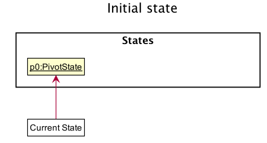

Step 2. The user executes `delete case 5` command to delete the 5th case in Pivot. The `delete case` command calls
`Model#commitPivot(String commandMessage, Undoable command)`. This will create a new `PivotState` object with
the modified state of Pivot, the delete case command and its command message. This `PivotState` object will then be saved in
`pivotStateList`. The `currentStatePointer` is shifted to the newly inserted `PivotState` object.

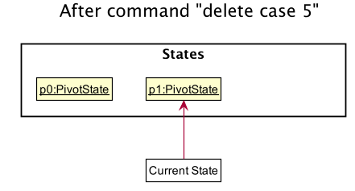

Step 3. The user executes `add case t:Lost Wallet …​` to add a new case. The `add case` command also calls
`Model#commitPivot(String commandMessage, Undoable command)`. This creates another `PivotState` object with the
modified Pivot, the add case command and its corresponding command message.
The `PivotState` object is saved into `pivotStateList`.

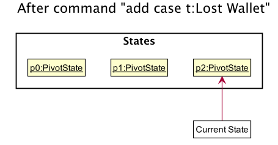

:information_source: **Note:** If a command fails its execution, it will not call
`Model#commitPivot(String commandMessage, Undoable command)`, so a new `PivotState` object will not be created and will not be
be saved into `pivotStateList`.

Step 4. The user then decides to open the newly added case and executes the command `open case 6` (assuming that the
newly added case is the 6th case in the list). Commands that do not modify Pivot, such as `open case` commands, will
not call `Model#commitPivot(String commandMessage, Undoable command)`. Thus, the `pivotStateList` remains unchanged.

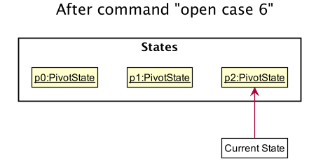

Step 5. The user now decides that adding the case was a mistake, and decides to undo that action by executing the `undo` command.
The `undo` command will call `Model#undoPivot()`, which will update `commandResult` to the command being undone, and
`commandMessageResult` to the corresponding message to display to the user the exact command that is being undone.
The `currentStatePointer` will also be shifted once to the left, pointing it to the previous `PivotState` object, and
restores PIVOT to that state.

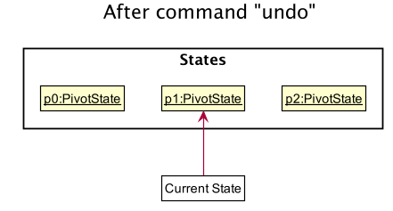

:information_source: **Note:** If the command to be undone is a main
page command, we revert PIVOT back to the main page. The `undo` command uses `Model#isMainPageCommand()` to check if this
is the case. If so, it will use `StateManager#resetState()` to return PIVOT to the main page. This is done because the
list of cases in the main page changes as a result of the undo, which may affect the case page that is open currently.
For instance, undo might result in the currently open case being removed from PIVOT (like in the above sequence of commands),
and since the case that is open will no longer exist, it is necessary for PIVOT to return to the main page.

:information_source: **Note:** If the `currentStatePointer` is at index 0, pointing to the
initial Pivot state, then there are no previous Pivot states to restore. The `undo` command uses `Model#canUndoPivot()` to check if this
is the case. If so, it will return an error to the user rather than attempting to perform the undo.

The following sequence diagram shows how the undo operation works:

:information_source: **Note:** The lifeline for `UndoCommand` should end 
at the destroy marker (X) but due to a limitation of PlantUML, the lifeline reaches the end of diagram.

The `redo` command does the opposite — it calls `Model#redoPivot()`, which shifts the `currentStatePointer` once
to the right, pointing to the previously undone state, and restores Pivot to that state. `commandResult` will be updated to
the command being redone, and `commandMessageResult` will be updated to the corresponding message in order to display to the
user the exact command that is being redone.

:information_source: **Note:** Similar to undo, if the command to be redone
is a main page command, we revert PIVOT back to the main page. The `redo` command uses `Model#isMainPageCommand()` to check
if this is the case. If so, it will use `StateManager#resetState()` to return PIVOT to the main page.

:information_source: **Note:** If the `currentStatePointer` is at index
`pivotStateList.size() - 1`, pointing to the latest `PivotState` object, then there are no undone `PivotState` objects to restore.
The `redo` command uses `Model#canRedoPivot()` to check if this is the case. If so, it will return an error to the user
rather than attempting to perform the redo.

Step 6. The user executes `open case 1`, followed by `edit title t:Robbery`. The edit title command calls
`Model#commitPivot(String commandMessage, Undoable command)`. Since the `currentStatePointer` is not pointing at the end
of the `pivotStateList`, all `PivotState` objects after the `currentStatePointer` will be purged. Reason: It
no longer makes sense to redo the `add case t:Lost Wallet …​` command. This is the behavior that most modern desktop
applications follow.

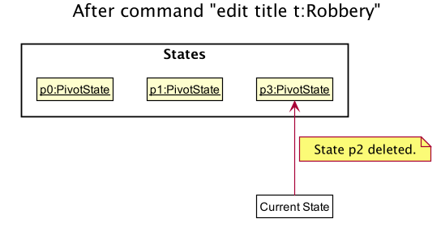

The following activity diagram summarizes what happens when a user executes a new command:

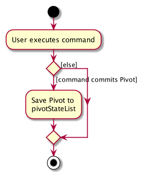

#### Design consideration:

##### Aspect: How undo executes

* **Alternative 1 (current implementation):** Saves the entire Pivot.
  * Pros: Easy to implement.
  * Cons: May have performance issues in terms of memory usage.

* **Alternative 2:** Individual command knows how to undo by
  itself.
  * Pros: Will use less memory (e.g. for `delete case`, just save the case being deleted).
  * Cons: We must ensure that the implementation of each individual command are correct.

### Archiving cases

The `archiveStatus` field of each `Case` determines whether a case is archived or not archived.
The `archiveStatus` is `ArchiveStatus.ARCHIVED` if archived, and `ArchiveStatus.DEFAULT` if not archived.

#### Implementation: Archive case
The `archive case` command allows the user to archive an investigation case listed in the `Main Page` of the `Home` section in the GUI.
The specified case will be removed from the list in the `Home` section and added to the `Archive` section in the GUI.

The `archive case` command mechanism is facilitated by `ArchiveCommand`. It extends the abstract class `Command` and contains
a `Index` of the `Case` to be archived. It implements the `ArchiveCommand#execute()` operation as required in the abstract parent class.

The Sequence Diagram below shows how the `ArchiveCommand` works.

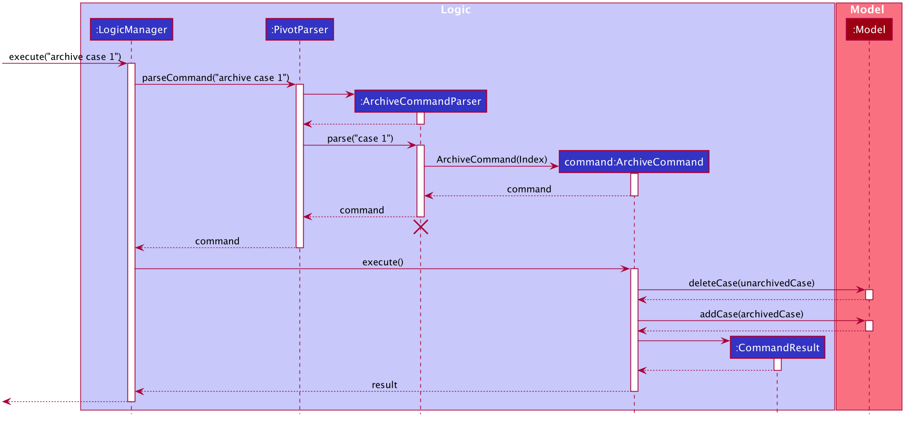

The user inputs the command `archive case 1` and the arguments are passed to the `Logic` component.

`PivotParser` processes the provided input and passes the arguments to `ArchiveCommandParser` to be processed.
If the command is of a valid format, a new `ArchiveCommand` will be created.

:information_source: 
**Note:** When the user provides invalid arguments, such as `archive c 1`, `ArchiveCommandParser` will raise an error and display the proper command format for the user.

Upon invoking `ArchiveCommand#execute()`, the class will extract the `Case` to be archived as specified by the `Index` provided.
A new `Case` with the same details will be created, except the `archiveStatus` field which will be set as `ArchiveStatus.ARCHIVED`.
The case to be archived will be deleted from the `model` and the new `Case` object will be added to the model. 
Thus, we have ensured that the `Case` is effectively archived.

The GUI will be updated correspondingly, with the archived case being removed from the `Home` section. The archived case will
appear in the `Archive` section when users input `list archive`.

#### Implementation: Unarchive case
The `unarchive case` command allows the user to unarchive an investigation case listed in the `Main Page` of the `Archive` section in the GUI.
The specified case will be removed from the list in the `Archive` section and added to the `Home` section in the GUI.

The `archive case` command mechanism is facilitated by `UnarchiveCommand`. It extends the abstract class `Command` and contains
a `Index` of the `Case` to be unarchived. It implements the `UnarchiveCommand#execute()` operation as required in the abstract parent class.

The Sequence Diagram below shows how the `UnarchiveCommand` works.

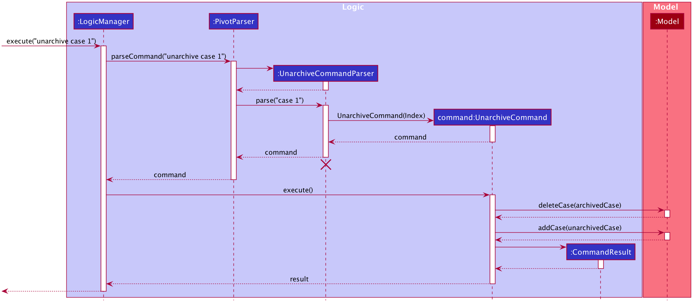

The `unarchive case` command works in a similar manner to the `archive case` command, 
except that it sets the newly created `Case` object's `archiveStatus` as `ArchiveStatus.DEFAULT` before
adding it to the `model`.

#### Implementation: List case and List archive
The GUI is split into the `Home` section and the `Archive` section. 
By using the commands `list case` and `list archive`, users can switch between the two sections and interact
with the cases at that particular section. 

The `list archive` command mechanism is facilitated by `ListArchiveCommand`. It extends the abstract class `ListCommand`. 
It implements the `ListArchiveCommand#execute()` operation as required in the abstract parent class.

The Sequence Diagram below shows how the `ListArchiveCommand` works.

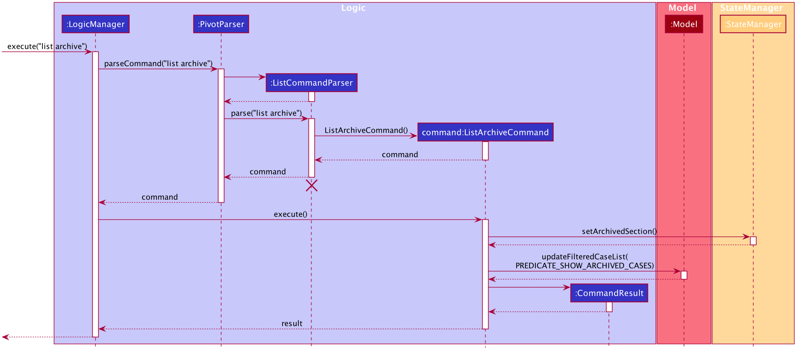

Upon invoking `ListArchiveCommand#execute()`, the `StateManager` will be notified via the `StateManager#setArchivedSection()`
method, which will update and store the program's state to be in the `Archive` section. 

The filtered case list in model will also be updated with the predicate to show archived cases. 
This predicate checks for the `archiveStatus` of cases, taking those that are `ArchiveStatus.ARCHIVED`. 
With this update, the GUI will also be automatically updated, bringing the program to the `Archive` section
and listing all archived cases. 

To switch back to the `Home` section, users can input the `list case` command. The `list case` command works in a similar manner
to the `list archive` command, but now, the filtered case list in `model` will be updated with the predicate to show all unarchived cases,
and the `StateManager` will be notified that the program's state is the `Home` section now.

#### Design consideration:

##### Aspect: How to consider a case as archived, and list archived cases.

* **Alternative 1 (current implementation):** Store as an enum field in `Case` and make use of appropriate predicates to show the 
cases
  * Pros: Easier to implement.
  * Cons: Do not have two separate lists for archived and unarchived cases, which results in more checks needed for other 
  functionalities like `find` command.

* **Alternative 2:** Store archived cases and unarchived cases as two different lists in `Model`.
  * Pros: More clarity in terms of which cases are being shown, hence other functionalities are
  less likely to be affected from the implementation. This could result in less bugs.
  * Cons: Difficult to implement this as we need to take into consideration the parsing of JSON files, 
  and the creation of two lists on startup.

--------------------------------------------------------------------------------------------------------------------
## **Effort**
The original AB3 is a one-layered implementation, where users can only interact with one list of items, such as adding and deleting items.

In PIVOT, we adopt a two-layer approach, which increases the complexity of the project. 

In the `Main Page`, users can interact with the list of `Cases` they see, such as adding and deleting a `Case`. 
Then, they can open a specific `Case`, opening up the `Case Page` which shows the details of the `Case`. They can interact with that particular `Case`, such as adding `Documents`, `Suspects` etc.

This approach required us to consider the design of the program carefully, so as to ensure that we are able to 
successfully open the correct `Case`, and ensure that the program is at the correct state each time, so that 
only valid commands can be used. This led to the decision of a `StateManager` class to handle the states of the program.

Various new features are also implemented.

The new `Open Document` feature allows users to easily open `Documents` that are stored in our program. The implementation of this feature
meant that we had to create a `references` folder on start-up, as well as properly store the file paths of the `Documents`.
The implementation of the feature had to be carefully designed, as we had to consider the different ways a user might use 
the program and handle them properly such that the program will not crash (e.g. if the user deletes a document that they added to PIVOT).

The `Archive` feature also required a careful consideration of the design alternatives, so as to show a different view in the GUI. 
We also had to consider how this feature would affect the existing commands.

Much thought and effort has been given to the design of this project, and enhancements have been made to the existing features as well.
The new features added will also increase the effectiveness of the program.   

--------------------------------------------------------------------------------------------------------------------

## **Documentation, logging, testing, configuration, dev-ops**

* [Documentation guide](Documentation.md)
* [Testing guide](Testing.md)
* [Logging guide](Logging.md)
* [Configuration guide](Configuration.md)
* [DevOps guide](DevOps.md)

--------------------------------------------------------------------------------------------------------------------

## **Appendix: Requirements**

### Product scope

**Target user profile**:

* police investigators who require an organisational tool
* has a need to manage a significant number of investigation cases
* prefer a structured app to organise information related to their cases
* prefer desktop apps over other types
* can type fast
* prefers typing to mouse interactions
* is reasonably comfortable using CLI apps
* has a basic understanding of file paths to manage his/her files

**Value proposition**:

A lot of detectives use physical folders, whiteboards to consolidate their investigation information.
This uses up a lot of physical resources such as printing papers.
There may also exist cluttered information across multiple cases.
This leads to disorganisation of evidence and documents during investigations,
which makes it difficult to link the investigation together.
Furthermore, physically looking through archive files can be time-consuming, and
they might miss out important information in the process.

PIVOT can help to better organise investigation cases and
group the relevant information on a digital platform.
This helps investigators to manage and easily locate the required information.
It also links up relations between people for better visualisation of the case so that detectives will not miss any information.

PIVOT can assist to manage investigation cases faster than a typical mouse/GUI driven app.

### User stories

Priorities: High (must have) - `* * *`, Medium (nice to have) - `* *`, Low (unlikely to have) - `*`

| Priority | As a …​                                    | I want to …​                     | So that I can…​                                             |
| -------- | ------------------------------------------ | ------------------------------ | ---------------------------------------------------------------------- |
| `* * *`  | investigator                               | create investigation cases with a relevant title                                   | store resources inside                                                  |
| `* * *`  | investigator                               | archive my cases                                                                   | organize and store records that are not relevant to me now              |
| `* * *`  | investigator                               | restore my cases from the archive                                                  | update past records when there is new information                       |
| `* * *`  | investigator                               | view the list of investigation cases that I'm currently handling                   | get an overview of the cases that I have                                |
| `* * *`  | investigator                               | view the list of investigation cases stored in the archive                         | retrieve past cases that I have                                         |
| `* * *`  | investigator                               | open individual investigation cases                                                | view the relevant details of that case                                  |
| `* * *`  | investigator                               | find for cases using their case details                                            | quickly retrieve cases based on my search terms                         |
| `* * *`  | investigator                               | indicate a state for different cases (e.g. closed/in-progress/cold case)           | easily see the status of my cases                                       |
| `* * *`  | investigator                               | add a description to an investigation case                                         | capture key information about the investigation case                    |
| `* * *`  | investigator                               | delete investigation cases                                                         | delete unwanted cases or cases that are wrongly created                 |
| `* * *`  | investigator                               | edit the status of a case                                                          | update the status of a case to have the most updated information        |
| `* * *`  | investigator                               | add relevant documents to an investigation case                                    | store multiple files related to a case                                  |
| `* * *`  | investigator                               | view the list of documents in an investigation case                                |                                                                         |
| `* * *`  | investigator                               | edit the documents in an investigation case                                        | give the document another name or change its file reference             |
| `* * *`  | investigator                               | delete irrelevant documents to an investigation case                               |  remove outdated documents                                              |
| `* * *`  | investigator                               | add relevant suspects to an investigation case                                     | link suspects to an investigation case with their personal information  |
| `* * *`  | investigator                               | view the list of suspects tied to an investigation case                            | refer to all suspects in an investigation case                          |
| `* * *`  | investigator                               | edit the suspects in an investigation case                                         | add or update information pertaining to that suspect                    |
| `* * *`  | investigator                               | delete suspects tied to an investigation case                                      | delete irrelevant suspects                                              |
| `* * *`  | investigator                               | add relevant witnesses to an investigation case                                    | link witnesses to an investigation case with their personal information |
| `* * *`  | investigator                               | view the list of witnesses tied to an investigation case                           | refer to all witnesses in an investigation case                         |
| `* * *`  | investigator                               | edit the witness in an investigation case                                          | add or update information pertaining to that witness                    |
| `* * *`  | investigator                               | delete witnesses tied to an investigation case                                     | delete irrelevant witnesses                                             |
| `* * *`  | investigator                               | add relevant victims to an investigation case                                      | link victims to an investigation case with their personal information   |
| `* * *`  | investigator                               | view the list of victims tied to an investigation case                             | refer to all victims in an investigation case                           | 
| `* * *`  | investigator                               | edit the victims in an investigation case                                          | add or update information pertaining to that victim                     |
| `* * *`  | investigator                               | delete victims tied to an investigation case                                       | delete irrelevant victims                                               |
| `* * *`  | new user                                   | view the available functions available in PIVOT                                    |                                                                         |
| `* * *`  | careless investigator                      | undo my previous command                                                           | quickly remove the changes from my previous command                     |
| `* * *`  | expert investigator                        | undo and redo multiple commands                                                    | navigate to the state of the program exactly as I need                  |
| `* * *`  | investigator                               | close the application when I am done using it                                      | safely exit the application                                             |

### Use cases

(For all use cases below, the **System** is the `PIVOT` and the **Actor** is the `user`, unless specified otherwise)

**Use case: Add Investigation Case**

**MSS**
1.  User requests to create a new active investigation case
2.  User specifies a title.
3.  PIVOT adds the new investigation case

    Use case ends.

**Extensions**
* 2a. The title is invalid.
    * 2a1. PIVOT shows an error message.
    
	  Use case ends.
	  
* 2b. User specifies a status for the case.
    * 2b1. PIVOT adds the new investigation case
      
      Use case ends.

* 2c. User specifies a status for the case.
    * 2c1. The status is invalid.
    * 2c2. PIVOT shows an error message.
    
	  Use case ends.

**Use case: List Investigation Case**

**MSS**
1.  User requests to list investigation cases
2.  PIVOT shows a list of investigation cases

    Use case ends.
    
**Use case: List Cases in Archive**

**MSS**
1.  User requests to list investigation cases in the archive
2.  PIVOT shows a list of investigation cases in the archive

    Use case ends.

**Use case: Delete Investigation Case**

**MSS**
1. User requests to list investigation cases
2. PIVOT shows a list of investigation cases
3. User requests to delete a specific investigation case in the list
4. PIVOT deletes the investigation case

   Use case ends.

**Extensions**
* 2a. The list is empty.

  Use case ends.

* 3a. The given index is invalid.
    * 3a1. PIVOT shows an error message.

      Use case resumes at step 3.

**Use case: Archive an investigation case**

**MSS**
1. User requests to list investigation cases
2. PIVOT shows a list of investigation cases
3. User requests to archive a specific case in the list
4. PIVOT moves the investigation case to the archive

    Use case ends.

**Extensions**
* 2a. The list is empty.

  Use case ends.

* 3a. The given index is invalid.
    * 3a1. PIVOT shows an error message.

      Use case resumes at step 3.    
      
**Use case: Restore a Case from the Archive**

**MSS**
1. User requests to list investigation cases in the Archive
2. PIVOT shows a list of investigation cases in the Archive
3. User requests to restore a specific case in the list
4. PIVOT moves the investigation case from the archive to the Home section

    Use case ends.

**Extensions**
* 2a. The list is empty.

  Use case ends.

* 3a. The given index is invalid.
    * 3a1. PIVOT shows an error message.

      Use case resumes at step 3.    
    
    
**Use case: Find an Investigation Case**

**MSS**
1. User requests to list investigation cases
2. PIVOT shows a list of investigation cases
3. User requests to find a specific investigation case in the list
4. User specified search terms
5. PIVOT shows a filtered list of the investigation cases which contain any search term

   Use case ends.

**Extensions**
* 2a. The list is empty.

  Use case ends. 

**Use case: Find an Investigation Case in the Archive**

**MSS**
1. User requests to list investigation cases in the archive
2. PIVOT shows a list of investigation cases in the archive
3. User requests to find a specific investigation case in the list
4. User specified search terms
5. PIVOT shows a filtered list of the investigation cases which contain any search term

   Use case ends.

**Extensions**
* 2a. The list is empty.

  Use case ends. 
  
     
**Use case: Open Investigation Case**

**MSS**
1. User requests to list investigation cases
2. PIVOT shows a list of investigation cases
3. User requests to open a specific investigation case in the list
4. PIVOT navigates to the specified investigation case page

   Use case ends.

**Extensions**
* 2a. The list is empty.

  Use case ends.

* 3a. The given index is invalid.
    * 3a1. PIVOT shows an error message.

      Use case resumes at step 1.

**Use case: Add Description for an Investigation Case**

**MSS**
1. User does (Use case: Open Investigation Case)
2. User requests to add a description to the investigation case and specifies a description
3. PIVOT adds the description to the investigation case

   Use case ends.

**Extensions**
* 2a. The description is empty.
    * 2a1. PIVOT shows an error message.
    
      Use case resumes at step 2.

* 2b. There is already an existing description.
    * 2b1. PIVOT shows an error message.

      Use case resumes at step 2.

**Use case: Add Document to Investigation Case**

**MSS**
1. User does (Use case: Open Investigation Case)
2. User requests to add a document to investigation case, specifies a document name and reference
3. PIVOT adds a new document to the investigation case

   Use case ends.

**Extensions**
* 2a. The name is invalid.
    * 2a1. PIVOT shows an error message.
    
      Use case resumes at step 2.

* 2b. The reference is invalid.
    * 2b1. PIVOT shows an error message.

      Use case resumes at step 2.

**Use case: Add Person[Suspect/Witness/Victim] in Investigation Case**

**MSS**
1. User does (Use case: Open Investigation Case)
2. User requests to add a person to a specified category (suspect/witness/victim).
3. User specifies all the name, sex and phone number of that person.
4. PIVOT adds the person to a specified category (suspect/witness/victim).

   Use case ends.

**Extensions**

* 2a. The given category of person to add is invalid.
    * 2a1. PIVOT shows an error message.

        Use case resumes at step 1.
        
* 3a. The name is invalid.
    * 3a1. PIVOT shows an error message.
    
      Use case resumes at step 3.

* 3b. The sex is invalid.
    * 3b1. PIVOT shows an error message.

      Use case resumes at step 3.
   
* 3c. The phone number is invalid.
    * 3c1. PIVOT shows an error message.

      Use case resumes at step 3.
      
* 3d. User specifies other optional fields (email address and address).
    * 3d1. PIVOT recognizes that fields are invalid.
    * 3d1. PIVOT shows an error message.

      Use case resumes at step 3.
      
* 3e. User specifies other optional fields (email address and address).
    * 3e1. PIVOT recognizes that fields are valid.
    * 3e1. PIVOT adds the person to a specified category (suspect/witness/victim).

      Use case ends.
      
**Use case: List Person[Suspect/Witness/Victim] in Investigation Case**

**MSS**
1. User does (Use case: Open Investigation Case)
2. User requests to list Persons in the case.
3. PIVOT shows a list of Persons in the case.

   Use case ends.
   
**Use case: List Document related to Investigation Case**

**MSS**
1. User does (Use case: Open Investigation Case)
2. User requests to list documents in the case
3. PIVOT shows a list of documents in the case

   Use case ends.

**Use case: Edit Investigation Case Title**

**MSS**
1. User does (Use case: Open Investigation Case)
2. User requests to edit the title of the investigation case
3. User specifies a title
4. PIVOT updates the title of the investigation case

    Use case ends.

**Extensions**
* 3a. The title is invalid.
    * 3a1. PIVOT shows an error message.
    
	  Use case ends.
	  
	 
**Use case: Edit Investigation Case Status**

**MSS**
1. User does (Use case: Open Investigation Case)
2. User requests to edit the status of the investigation case
3. User specifies a status
4. PIVOT updates the status of the investigation case

    Use case ends.

**Extensions**
* 3a. The status is invalid.
    * 3a1. PIVOT shows an error message.
    
	  Use case ends.
	  
	  
**Use case: Edit Description for an Investigation Case**

**MSS**
1. User does (Use case: Open Investigation Case)
2. User requests to edit the description of the investigation case
3. User specifies a description
4. PIVOT updates the description of the investigation case

   Use case ends.

**Extensions**
* 3a. The description is empty.
    * 3a1. PIVOT shows an error message.
    
      Use case resumes at step 3.

      
**Use case: Edit Document to Investigation Case**

**MSS**
1. User does (Use case: List Document related to Investigation Case)
2. User requests to edit a document to investigation case
3. User specifies a document's index in the list
4. User specifies fields(name and reference) that they want to edit
5. PIVOT updates the document with the specified fields

   Use case ends.

**Extensions**
* 1a. The list is empty.

  Use case ends.
  
* 3a. The index is invalid.
    * 3a1. PIVOT shows an error message.
    
      Use case resumes at step 3.
      
* 4a. The name given is invalid.
    * 4a1. PIVOT shows an error message.
    
      Use case resumes at step 4.

* 4b. The reference given is invalid.
    * 4b1. PIVOT shows an error message.

      Use case resumes at step 4.
      
* 4c. User did not specify any fields to change.
    * 4c1. PIVOT shows an error message.

      Use case resumes at step 4.
      

**Use case: Edit Person[Suspect/Witness/Victim] in Investigation Case**

**MSS**
1. User does (Use case: List Person[Suspect/Witness/Victim] in Investigation Case)
2. User requests to edit a person of a specified category (suspect/witness/victim).
3. User specifies a person's index in the list
4. User specifies fields(name/sex/phone/email/address) that they want to edit
5. PIVOT updates the person of a specified category (suspect/witness/victim) with the specified fields.

   Use case ends.

**Extensions**
* 1a. The list is empty.

  Use case ends.
  
* 2a. The given category of person to add is invalid.
    * 2a1. PIVOT shows an error message.

        Use case resumes at step 2.
        
* 3a. The index is invalid.
    * 3a1. PIVOT shows an error message.
    
      Use case resumes at step 3.
     
    
* 4a. The fields specified are invalid.
    * 4a1. PIVOT recognizes that fields are invalid.
    * 4a1. PIVOT shows an error message.

      Use case resumes at step 4.
      
* 4b. User did not specify any fields to change.
    * 4b1. PIVOT shows an error message.

      Use case ends.
      
**Use case: Delete Description for an Investigation Case**

**MSS**
1. User does (Use case: Open Investigation Case)
2. User requests to delete the description of the investigation case
3. PIVOT deletes the description of the investigation case

   Use case ends.

**Extensions**
* 2a. The case has no description to delete.
    * 2a1. PIVOT shows an error message.
    
      Use case resumes at step 2.
      
**Use case: Delete Document from Investigation Case**

**MSS**
1. User does (Use case: List Document related to Investigation Case)
2. User requests to delete a document to investigation case
3. User specifies a document's index in the list
4. PIVOT deletes the document from the list

   Use case ends.

**Extensions**
* 1a. The list is empty.

  Use case ends.

* 3a. The given index is invalid.
    * 3a1. PIVOT shows an error message.

      Use case resumes at step 1.

**Use case: Delete Person[Suspect/Witness/Victim] in Investigation Case**

**MSS**
1. User does (Use case: List Person[Suspect/Witness/Victim] in Investigation Case)
2. User requests to delete a person of a specified category (suspect/witness/victim).
3. User specifies a person's index in the list
4. PIVOT deletes the person from the list.

   Use case ends.

**Extensions**
* 1a. The list is empty.

    Use case ends.
    
* 2a. The given category of person to add is invalid.
    * 2a1. PIVOT shows an error message.

        Use case resumes at step 2.
        
* 3a. The given index is invalid.
    * 3a1. PIVOT shows an error message.

        Use case resumes at step 3.
        
**Use case: Open Document**

**MSS**
1. User does (Use case: List Document related to Investigation Case)
2. User requests to open a specific document in the list
3. User specifies a document's index in the list to open
4. PIVOT opens the specified document

   Use case ends.

**Extensions**
* 1a. The list is empty.

    Use case ends.

* 3a. The given index is invalid.
    * 3a1. PIVOT shows an error message.

        Use case resumes at step 3.

* 3b. The specified document does not exist in the saved reference.
    * 3b1. PIVOT shows an error message.

        Use case resumes at step 3.

**Use case: Return to the Main Page**

**MSS**
1. User does (Use case: Open Investigation Case)
2. User requests to navigate to the main page
3. PIVOT navigates to the main page

   Use case ends.

**Extensions**
* *a. At any time, user can request to navigate to the main page.
    * *a1. PIVOT brings the user back to the main page.

    Use case ends.

**Use case: Exit Application**

**MSS**
1. User requests to exit the application
2. PIVOT terminates.

    Use case ends.

        
**Use case: Undo command**

**MSS**
1. User starts up PIVOT
2. User does a command
3. User requests to undo the previous command
4. PIVOT reverts the effects of the previous command that can be undone

   Use case ends.

**Extensions**
* 1a. User requests to undo the previous command.
    * 1a1. There is no command to undo
    
    Use case ends.
    
* 2a. User does a command that can be un-done.
    * 2a1. User does (Use case: Delete Document from Investigation Case)
    * 2a2. User requests to undo the previous command
    * 2a3. PIVOT restores the Document which has been deleted by the previous command 
    
    Use case ends.

* 2b. User does a command that cannot be undone.
    * 2b1. User does (Use case: List Investigation Case)
    * 2b2. User requests to undo the previous command
    * 2b3. PIVOT is already at its initial state
    
    Use case ends.
    

**Use case: Redo command**

**MSS**
1. User does (Use case: Undo command)
2. User requests to redo a command
3. PIVOT restores the effects of the previous command that was undone, if any

   Use case ends.

**Extensions**
    
* 1a. Undo command was successful.
    
    Use case resumes at step 2.

* 1b. There was nothing to undo.

    Use case resumes at step 2.

### Non-Functional Requirements

1.  Should work on any _mainstream OS_ as long as it has Java `11` or above installed.
2.  Should be able to hold up to 1000 Cases without a noticeable sluggishness in performance for typical usage.
3.  A user with above average typing speed for regular English text (i.e. not code, not system admin commands) should be able to accomplish most of the tasks faster using commands than using the mouse.
4.  The system should not take above 2 seconds to execute any command.

### Glossary

* **Mainstream OS**: Windows, Linux, Unix, OS-X
* **Investigation Case**: The investigation case encapsulating all relevant data the police wants to keep track of
* **Investigation Case Tag**: The status of the case (Active/In-Progress, Closed, Cold Case)
* **Document**: An actual document/file stored in the project directory
* **Person**: Data stored in the investigation case (For suspects, witnesses or victims related)
* **File Paths**: System Location of the specified file inside the project directory

--------------------------------------------------------------------------------------------------------------------

## **Appendix: Instructions for manual testing**

Given below are instructions to test the app manually.

:information_source: **Note:** These instructions only provide a starting point for testers to work on;
testers are expected to do more *exploratory* testing.

### Launch and shutdown

1. Initial launch

   1. Download the jar file and copy into an empty folder

   1. Double-click the jar file Expected: Shows the GUI with a set of sample contacts. The window size may not be optimum.

1. Saving window preferences

   1. Resize the window to an optimum size. Move the window to a different location. Close the window.

   1. Re-launch the app by double-clicking the jar file. 
       Expected: The most recent window size and location is retained.

1. _{ more test cases …​ }_

### Deleting a person

1. Deleting a person while all persons are being shown

   1. Prerequisites: List all persons using the `list` command. Multiple persons in the list.

   1. Test case: `delete 1` 
      Expected: First contact is deleted from the list. Details of the deleted contact shown in the status message. Timestamp in the status bar is updated.

   1. Test case: `delete 0` 
      Expected: No person is deleted. Error details shown in the status message. Status bar remains the same.

   1. Other incorrect delete commands to try: `delete`, `delete x`, `...` (where x is larger than the list size) 
      Expected: Similar to previous.

1. _{ more test cases …​ }_

### Saving data

1. Dealing with missing/corrupted data files

   1. _{explain how to simulate a missing/corrupted file, and the expected behavior}_

1. _{ more test cases …​ }_
