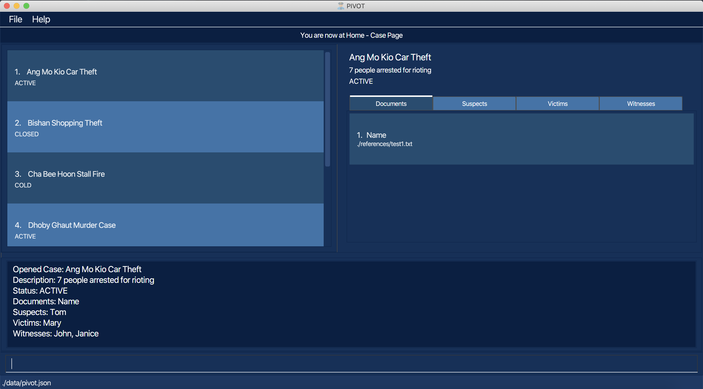

Police Investigation Virtual Organisational Tool (PIVOT) is a **desktop app to assist the police investigators in keeping track of their investigations and relevant information. It is optimized for use via a Command Line Interface** (CLI) while still having the benefits of a Graphical User Interface (GUI).
If you can type fast, PIVOT can manage your investigation cases faster than traditional GUI apps.

* Table of Contents
{:toc}

--------------------------------------------------------------------------------------------------------------------

## Quick start [To be updated]

1. Ensure you have Java `11` or above installed in your Computer.

1. Download the latest release from [here](https://github.com/AY2021S1-CS2103-F09-2/tp/releases).

1. Copy the file to the folder you want to use as the _home folder_ for PIVOT.

1. Double-click the file to start the app. The GUI similar to the below should appear in a few seconds. Note how the app contains some sample data. 
   

1. Type the command in the command box and press Enter to execute it. e.g. typing **`help`** and pressing Enter will open the help window. 
   Some example commands you can try:

   * **`list`** : Lists all investigation cases.

   * **`case`**`Kovan double murders` : Adds a case named `Kovan double murders` to PIVOT.

   * **`delete`**`case 3` : Deletes the 3rd case shown in the current list.

   * **`exit`** : Exits the app.

1. Refer to the [Features](#features) below for details of each command.

--------------------------------------------------------------------------------------------------------------------

## Features

**:information_source: Notes about the command format:** 

* Words in `[UPPER_CASE]` (with square brackets) are the parameters to be supplied by the user. 
  e.g. in `case [TITLE]`, `[TITLE]` is a parameter which can be used as `case Kovan double murders`.

### Main page
The main page of the application when the user first enters the app.

#### Adding an active investigation case: `case [TITLE]`
Adds a new investigation case which has the active tag by default.

Format: `case [TITLE]`

Example: `case Kovan double murders` creates a new investigation case with the title “Kovan double murders”.

#### List all investigation cases: `list case`
Lists all available investigation cases in PIVOT.

Format: `list case`

#### Delete an investigation case: `delete case [CASE_NO]`
Deletes the specified investigation case.

Format: `delete case [CASE_NO]`

Example: `list` followed by `delete case 2` deletes the 2nd case in the investigation list.

#### Open an investigation case: `open case [CASE_NO]`
Enters the specified investigation case where users can add more information regarding the case
(see Investigation Case Page).

Format:  `open case [CASE_NO]`

Example: `list` followed by `open case 1` opens the 1st case in the investigation list.

#### Exit application: `exit`
Exits the application.

### Investigation Case page
The page of the application when the user opens a specified investigation case.

#### Add investigation case description: `desc [DESC]`
Adds the description of the investigation

Format: `desc [DESC]`

Example: `desc Kovan double murders of twins xxx and yyy` updates the description of this investigation case to “Kovan double murders of twins xxx and yyy”.

#### Edit investigation case tag: `tag [STATUS]`
Edits the tag of the investigation (tags: ACTIVE, COLD, CLOSED)

Format: `tag [STATUS]`

Example: `tag CLOSED` updates the tag status of this investigation case to “CLOSED”.

#### Adding a document related to the case: `doc [TITLE]`
Adds a new document that is related to the investigation case.

Format: `doc [TITLE]`

Example: `doc Case Details` adds a new document with title “Case Details” to the investigation case.

#### List all documents related to the case: `list doc`

Lists all added documents that are related to the investigation case.

Format: `list doc`

#### Delete document: `delete doc [DOC_NO] `
Deletes the specified document reference.

Format: `delete doc [DOC_NO]`

Example: `delete doc 0`

#### Open document: `open doc [DOC_NO]`

Opens the specified document reference.

Format: `open doc [DOC_NO]`

Example: `open doc 0`

--------------------------------------------------------------------------------------------------------------------

## FAQ

**Q**: How do I transfer my data to another Computer? 
**A**: Install the app in the other computer and overwrite the empty data file it creates with the file that contains the data of your previous AddressBook home folder.

--------------------------------------------------------------------------------------------------------------------

## Command summary

#### Main Page Commands
Command | Format |  Association
--------|--------|------
**case** | `case [TITLE]` | Investigation
**list** | `list case` | Investigation
**delete** | `delete case [CASE_NO]` | Investigation
**open** | `open case [CASE_NO]` | Investigation
**exit** | `exit` | General

#### Investigation Page Commands
Command | Format |  Association
--------|--------|------
**desc** | `desc [DESC]` | Investigation
**tag** | `tag [STATUS]` | Investigation
**document** | `doc [TITLE]` | Document
**list doc** | `list doc` | Document
**delete doc** | `delete doc [DOC_NO]` | Document
**open doc** | `open doc [DOC_NO]` | Document
**suspect** | `suspect [NAME]` | Suspect
**list suspect** | `list suspect` | Suspect
**delete suspect** | `delete suspect [SUSPECT_NO]` | Suspect
**victim** | `victim [NAME]` | Victim
**list victim** | `list victim` | Victim
**delete victim** | `delete victim [VICTIM_NO]` | Victim
**witness** | `witness [NAME]` | Witness
**list witness** | `list witness` | Witness
**delete witness** | `delete witness [WITNESS_NO]` | Witness
**return** | `return` | General
**exit** | `exit` | General
